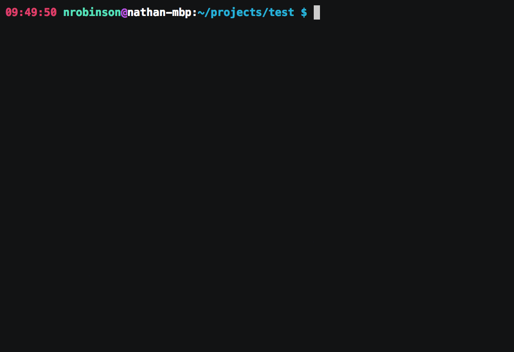

<p align="center">

</p>

# Particle Offline Utility: The Ultimate Local Particle Experience for Linux and macOS

[](https://gitter.im/po-util/Lobby?utm_source=badge&utm_medium=badge&utm_campaign=pr-badge&utm_content=badge)
[](https://nrobinson2000.herokuapp.com)
[](https://www.paypal.me/nrobinson2000)
[](https://nrobinson2000.github.io/po-util/donate)
[](https://github.com/nrobinson2000/po-util/issues)
[](https://github.com/nrobinson2000/po-util/stargazers) [](https://travis-ci.org/nrobinson2000/po-util)
[](https://circleci.com/gh/nrobinson2000/po-util/tree/master)
[](https://twitter.com/intent/tweet?ref_src=twsrc%5Etfw&text=Check%20out%20po-util.%20It%27s%20a%20handy%20script%20for%20installing%20and%20using%20the%20%40particle%20Toolchain%20on%20Linux%20and%20macOS.&tw_p=tweetbutton&url=https%3A%2F%2Fnrobinson2000.github.io/po-util/)

Particle Offline Utility, pronounced `po-util`, is a tool for installing and
using the Particle Toolchain on Linux and macOS.

`po-util` makes it easy for developers to download the Particle Toolchain and install the required dependencies to quickly begin creating projects using the Particle Platform.

`po-util` features a responsive experience, giving developers the tools they
need for seamless local development, providing understandable commands for
simplifying complex tasks like properly compiling and flashing firmware.

<p align="center">

</p>

# Install

There are two versions of po-util. The first is [po-util Classic](https://github.com/nrobinson2000/po-util), which is designed for Linux distributions. The second is [po-util Homebrew Edition](https://github.com/nrobinson2000/homebrew-po), which is designed for macOS.

**The quickest and easiest way to install `po-util` on Linux or macOS is to run the following:**

```
$ bash <(curl -sL https://master.po-util.com/install)
```

**Note:**
Both versions of po-util have the same features. In December 2016, Homebrew Edition was forked from po-util in order to allow po-util to be installed with Homebrew.  The original po-util was renamed to Classic, and was made Linux exclusive. Both Classic and Homebrew Edition continue to be developed and maintained in parallel.

<p align="center">

</p>

# Key Features

### Library Manager

The library manager makes it easy to use Particle libraries when developing
with po-util locally by using `git` to download Particle libraries hosted on
GitHub and save them to a ~/.po-util/lib directory so that they make be linked
inside of projects later. [Read more about the Library Manager here.](http://community.particle.io/t/how-to-use-po-utils-library-manager/26735)

<p align="center">

</p>

### Full dependency setup

`po-util` installs all of the dependencies required for local Particle
Development, including the [ARM toolchain](https://launchpad.net/gcc-arm-embedded), [dfu-util](http://dfu-util.sourceforge.net/),
[nodejs](https://nodejs.org/en/), [particle-cli](https://github.com/spark/particle-cli) and the [Particle firmware](https://github.com/spark/firmware).

### Local compilation and support for flashing over USB or OTA

Building firmware locally for Electrons, Photons and P1s, and automatically
flashing over USB using dfu-util or Over The Air using particle-cli.
Sequentially flashing multiple devices at once over the air is also supported.

### Shortcuts for Building in Atom

`po-util` supports shortcuts for [Atom](https://atom.io), the popular open-
source IDE by GitHub. The shourcuts provide quick access to commonly used
commands for `po-util`, including: building firmware, flashing firmware over
USB, and flashing firmware Over The Air. [Read more about the shortcuts
here.](http://community.particle.io/t/po-util-a-toolchain-installer-helper-for-linux-and-osx/21015/29?u=nrobinson2000)

<p align="center">

</p>

# Project Structure

The directory structure of a full `po-util` project is arranged like so:

```
firmware/
├ main.cpp
└ lib1/
  ├ lib1.cpp
  ├ lib1.h
  └ ...
bin/
├ firmware.bin
└ ...
 ci/
 devices.txt
 libs.txt
 .atom-build.yml
 .travis.yml
 .gitignore
 .git/
 README.md
```

  * All user code is kept inside of `firmware/`.
  * The compiled binary will be named `firmware.bin`, and it will be in `bin/`.
  * You can keep track of which devices are in a project and list which ones to be flashed Over The Air in `devices.txt`.
  * Libraries are kept track of in `libs.txt`.
  * Atom shortcuts are configured in`.atom-build.yml`.
  * Every `po-util` project is initialized as a repository with scripts in `ci/` to use [Travis CI](https://travis-ci.org/) for testing.

# Project setup

When using `po-util`, your code is arranged into projects with the structure
described above. This not only lets you easily work on many projects on one
computer, but it provides a standardized way of building locally.

Creating a project with `po-util` is simple when you use `po init` to initialize a project by creating the necessary files. Below is an example:

    $ po init DEVICE_TYPE someProject

You can set `DEVICE_TYPE` to either `photon`, `P1`, `electron`, `core`, `pi`, or `duo`. This is
necessary for generating the Atom shortcuts file appropriately.

# More Information

Here is some more information about using `po-util`.

### Writing Firmware

`po-util` compiles any `.cpp` and `.h` files found in the `firmware/`
directory, but not `.ino` files, so `#include "Particle.h"` must be present
in your `main.cpp` file. This is done for you when you run the `po init`
command to create a project directory.

### Building Firmware

To compile firmware, simply run `po DEVICE_TYPE build`, substituting `DEVICE_TYPE` for
`photon`, `P1`, or `electron`. To compile and flash firmware to your device
using dfu-util, simply run `po DEVICE_TYPE flash`. To clean the project, run `po
DEVICE_TYPE clean`.

<p align="center">

</p>

### DFU Commands

To upload precompiled code over USB, run `po DEVICE_TYPE dfu`. To put your device
into dfu mode, run `po dfu-open`. To get your device out of dfu mode, run `po
dfu-close`.

<p align="center">

</p>

### Over The Air (OTA) Uploading

To upload precompiled code over the air using particle-cli, run `po DEVICE_TYPE ota
DEVICE_NAME`, where `DEVICE_NAME` is the name of your device in the Particle
cloud. You must be logged into particle-cli to use this feature. You can log
into particle-cli with `particle cloud login`.

You can also flash code to multiple devices at once by passing the `-m` or
`--multi` argument to `ota`. This would look like `po DEVICE_TYPE ota -m`. This
relies on a file called `devices.txt` that you must create in your `po-util`
project directory.

**NOTE: This is different from the product firmware update feature in the Particle Console because it updates the firmware of devices one at a time and only if the devices are online when the command is run.**

<p align="center">

</p>

# Testimonials

<blockquote><p>"I think you identified a common pain point for a lot of users, and the automated installation of the Particle toolchain is a problem that we've been focused on a lot recently ... you should already feel proud of yourself because you have made a meaningful contribution to the community. We are all very thankful for it - our community regularly impresses us, and you are certainly not an exception."</p>
<p style="text-align: left"><a href="http://nrobinson2000.me/po-util-recognition.pdf">Will Hart, Particle General Manager</a></p></blockquote>
<hr>

<blockquote><p>"It has been nearly flawless and a HUGE productivity booster... I cannot believe your steps worked installing so many utils and dependencies perfectly... The Particle world owes you a big debt. If there were Emmy awards for Particle contribs, you would get one."</p>
<p style="text-align: left"><a href="http://community.particle.io/t/moving-project-from-web-ide-to-particle-dev-on-a-mac/28398/5?u=nrobinson2000">Andrew Ward, Particle Community Member</a></p></blockquote>
<hr>

<blockquote><p>"Nice! This is great stuff. Definitely helpful for the local dev / offline use case.
Thanks for sharing."</p>
<p style="text-align: left"><a href="http://community.particle.io/t/po-util-a-toolchain-installer-helper-for-linux-and-osx/21015/2?u=nrobinson2000">Avidan Ross, Particle Investor</a></p></blockquote>
<hr>

<blockquote><p>"Thanks a lot for this amazing tool. I finally managed to get everything as I wanted: to be able to work off-line."</p>
<p style="text-align: left"><a href="https://community.particle.io/t/po-util-a-toolchain-installer-helper-for-linux-and-osx/21015/34?u=nrobinson2000">Yannick, Particle Community Member</a></p></blockquote>
<hr>

<blockquote><p>"Po-util is a very handy script - thanks for sharing."</p>
<p style="text-align: left"><a href="http://community.particle.io/t/po-util-a-toolchain-installer-helper-for-linux-and-osx/21015/15?u=nrobinson2000">H.S, Particle Community Member</a></p></blockquote>
<hr>

<blockquote><p>"I can't heart this enough!"</p>
<p style="text-align: left"><a href="http://community.particle.io/t/po-util-a-toolchain-installer-helper-for-linux-and-osx/21015/27?u=nrobinson2000">Josh Fisher, Particle Community Member</a></p></blockquote>
