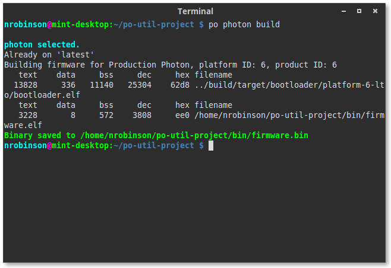
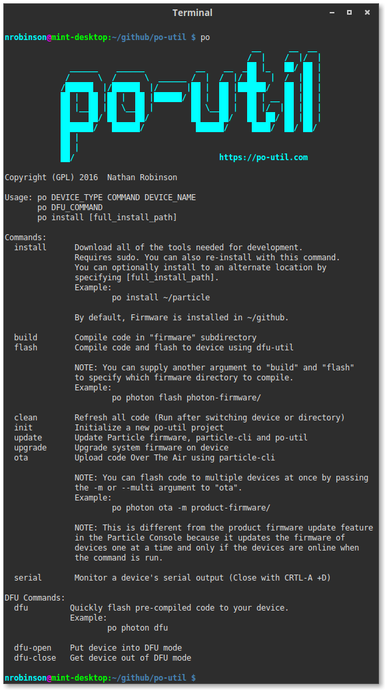
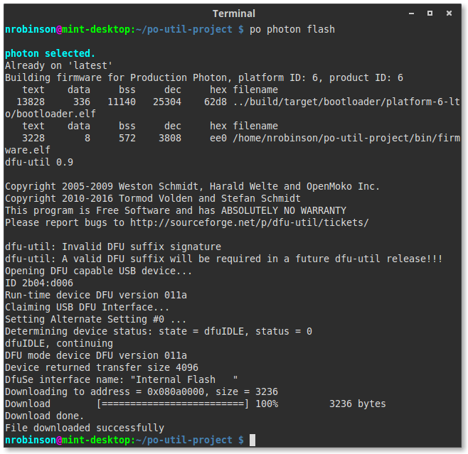
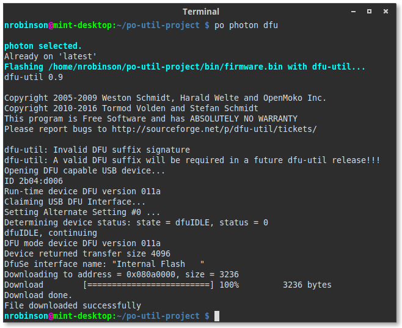

<p align="center" >

</p>

## Particle Offline Utility: The handy script for installing and using the Particle Toolchain on Ubuntu-based Distros and OSX

[](https://nrobinson2000.herokuapp.com/)
[](https://nrobinson2000.github.io/donate-bitcoin)
[](https://github.com/nrobinson2000/po-util/issues)
[](https://github.com/nrobinson2000/po-util/stargazers)
[](https://travis-ci.org/nrobinson2000/po-util) [](https://circleci.com/gh/nrobinson2000/po-util)

# About

Particle Offline Utility, pronounced po-util, is a script for installing and using the Particle Toolchain on Ubuntu-based distros and OSX.

Po-util makes it easy for developers to download the Particle Toolchain and install the required dependencies to quickly begin creating projects using the Particle Platform.

Po-util features a responsive experience, giving developers the tools they need for seamless local development. Po-util provides understandable commands for simplifying complex tasks like properly compiling and flashing firmware.

Po-util downloads and installs: [dfu-util](http://dfu-util.sourceforge.net/), [nodejs](https://nodejs.org/en/), [gcc-arm-embedded](https://launchpad.net/gcc-arm-embedded), [particle-cli](https://github.com/spark/particle-cli), and the [Particle Firmware source code](https://github.com/spark/firmware).


<p align="center">

</p>


# Install
The easiest and most secure way to install po-util is to download `po-util.sh` from [GitHub](https://raw.githubusercontent.com/nrobinson2000/po-util/master/po-util.sh) and run:
```
./po-util.sh install
```
to install po-util and dependencies.

**You can also install po-util by cloning the GitHub repository:**
```
git clone https://github.com/nrobinson2000/po-util
cd po-util
./po-util.sh install
```
**Or you can directly download and run the script in Terminal:**
```
curl -fsSLO https://raw.githubusercontent.com/nrobinson2000/po-util/master/po-util.sh
./po-util.sh install
```
When installing po-util, an alias is added to your `.bashrc` that allows you to run `po` from anywhere to use po-util. 

Note: We download everything from well known locations and GitHub.  While we believe this is a reasonable approach, it's always a good idea to know what's going on under the hood.  [The po-util script can be found on GitHub if you want to manually download and run it.](https://github.com/nrobinson2000/po-util/blob/master/po-util.sh)

<p align="center">

</p>


# Tips

##### Here are some helpful tips to assist you while working with po-util.

### Project Directory Structure
The directory structure of a full po-util project is arranged like so:

```
po-util_project/
  ├ firmware/
  | ├ main.cpp
  | ├ lib.cpp
  | └ lib.h
  ├ bin/
  | ├ firmware.bin
  | └ ...
  ├ devices.txt
  └ README.md
```

All of the C++ files go in the `firmware/` directory, and the compiled binary
will appear in the `bin/` directory, named `firmware.bin`.

### Writing Firmware
Po-util compiles any `.cpp` and `.h` files found in the `firmware/` directory, but not `.ino` files, so `#include "application.h"` must be present in your `main.cpp` file.  This is done for you when you run the `po init` command to create a project directory.

### Building Firmware
To compile firmware, simply run `po DEVICE build`, substituting `DEVICE` for
`photon`, `P1`, or `electron`. To compile and flash firmware to your device using dfu-util, simply run `po DEVICE flash`. To clean the project, run `po DEVICE clean`.

<p align="center">

</p>

### DFU Commands
To upload precompiled code over USB, run `po DEVICE dfu`. To put your device into dfu mode, run `po dfu-open`. To get your device out of dfu mode, run `po dfu-close`.

<p align="center">

</p>

### Over The Air (OTA) Uploading
To upload precompiled code over the air using particle-cli,
run `po DEVICE ota DEVICE_NAME`, where `DEVICE_NAME` is the name of your device
in the Particle cloud. You must be logged into particle-cli to use this
feature. You can log into particle-cli with `particle cloud login`.

You can also flash code to multiple devices at once by passing the `-m` or
`--multi` argument to `ota`.  This would look like `po DEVICE ota -m`.
This relies on a file called `devices.txt` that you must create in your po-util
project directory.

**NOTE: This is different from the product firmware update feature in the Particle Console because it updates the firmware of devices one at a time and only if the devices are online when the command is run.**

<p align="center">

</p>

### Triggering DFU mode on your Device(s)
By default, po-util changes the trigger DFU Mode baud rate to `19200`, as it is a more friendly baud rate for Linux Distributions.  To make your device(s) recognize this baud rate, you must run `po DEVICE update`. This will also update the system firmware on your device(s).

If you wish to use the default Particle DFU Mode baud rate, you may change the `DFUBAUDRATE=19200` line in the `~/.po` configuration file to `DFUBAUDRATE=14400`.


# Why I created this script

I created this script because Particle does not currently have a script for easily installing the Particle Toolchain and depedencies on Linux and OSX. I created this script in order to help out other Particle users and to improve my bash scripting skills. It would be my dream come true if Particle added this script to its resources or gave it a shout out in its documentation. If that happened, I would feel very proud of myself for making a meaningful contribution.
